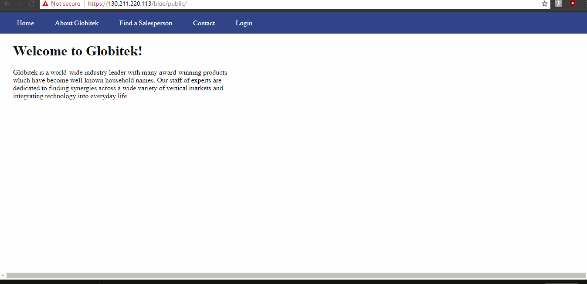
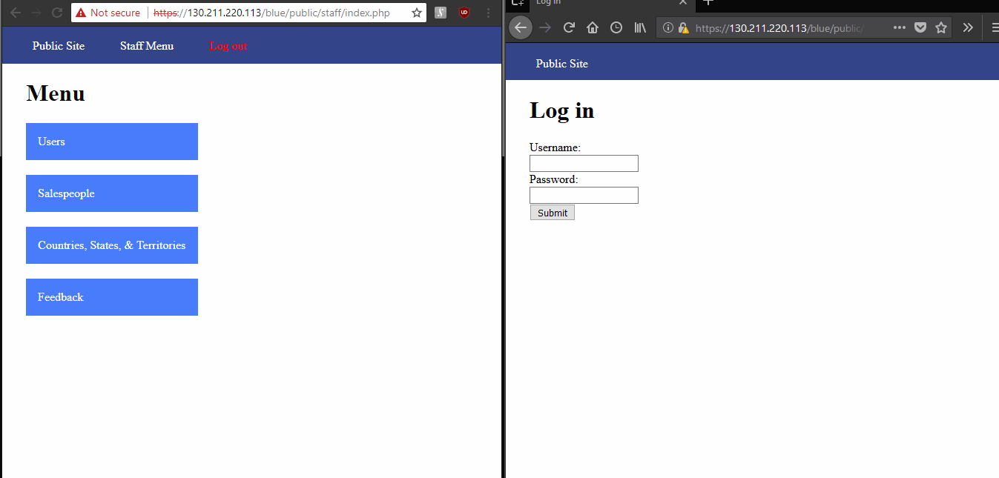
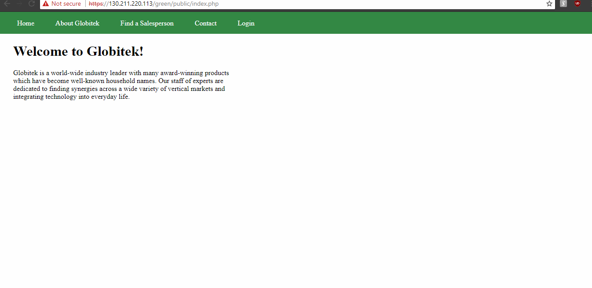
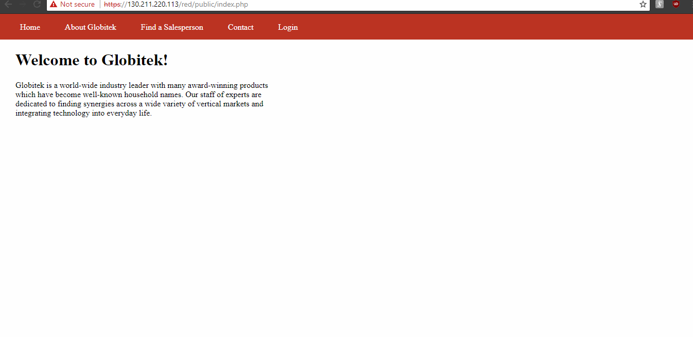
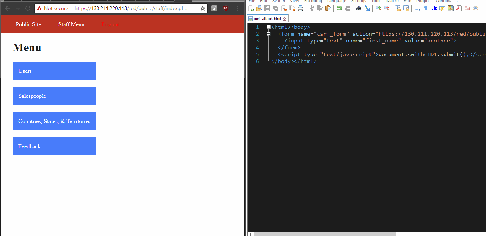

# Project 8 - Pentesting Live Targets

Time spent: **23** hours spent in total

> Objective: Identify vulnerabilities in three different versions of the Globitek website: blue, green, and red.

The six possible exploits are:
* Username Enumeration
* Insecure Direct Object Reference (IDOR)
* SQL Injection (SQLi)
* Cross-Site Scripting (XSS)
* Cross-Site Request Forgery (CSRF)
* Session Hijacking/Fixation

Each version of the site has been given two of the six vulnerabilities. (In other words, all six of the exploits should be assignable to one of the sites.)

## Blue

Vulnerability #1: SQL Injection

Vulnerability #2: Session Hijacking/Fixation

## Green

Vulnerability #1: Username Enumeration

Vulnerability #2: Cross-Site Scripting

## Red

Vulnerability #1: Insecure Direct Object Reference

Vulnerability #2: Cross-Site Request Forgery

## Notes
1. Which attacks were easiest to execute? Which were the most difficult?  
   #### Easiest:
    - sqli
    - session hijack
    - xss
    - username enumeration
   #### Difficult:
    - idor
    - csrf
  
2. What is a good rule of thumb which would prevent accidentally username enumeration vulnerabilities like the one created here?  
  
Don't use any special stylesheet feature.  
  
3. Since you should be somewhat familiar with the CMS and how it was coded, can you think of another resource which could be made vulnerable to an Insecure Direct Object Reference? What code could be removed which would expose it? (Hint: It was also the answer to the first bonus objective to the Weekly Assignment for week 3.)  
  
You can also retrieve a file using the file name. The second question doesn't properly follow up my answer, but properly formatting the endpoint and hide downloadable links might be able to prevent this.  
    
4. Many SQL Injections use OR as part of the injected code. (For example: ' OR 1=1 --'.) Could AND work just as well in place of OR? (For example: ' AND 1=1 --'.) Why or why not?  
  
No you can't because we want to return a true value inside "WHERE..." clause.  
    
5. A stored XSS attack requires patience because it could be stored for months before being triggered. Because of this, what important ingredient would an attacker most likely include in a stored XSS attack script?  
  
The most important part is being able to run on a script from a user-triggered action (such as click).  
  
6. Imagine that one of your classmates is an authorized admin for the site's CMS and you are not. How would you get them to visit the self-submitting, hidden form page you created in Objective #5 (CSRF)?  
  
I would make them run an imbedded hmtl link that seems harmless (as it would be styled as appropriately).  
  
7. Compare session hijacking and session fixation. Which attack do you think is easier for an attacker to execute? Why? One of them is much easier to defend against than the other. Which one and why?  
  
Session fixation is a lot easier for attacker to execute, because they just need the victim to use a specific session from a link. However, a user can change their session id at every call making it difficult for a hijacking.
